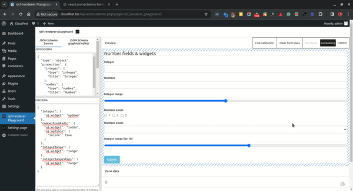

# JSON Schema field/form renderer

## What
Describe any WordPress data with JSON schema without the need to register it through PHP, or any other method. Since [5.8 version](https://make.wordpress.org/core/2021/06/25/introducing-theme-json-in-wordpress-5-8/), WordPress is already harvesting the benefits of JSON schema with [theme.json](https://developer.wordpress.org/block-editor/how-to-guides/themes/global-settings-and-styles/) and [block.json](https://developer.wordpress.org/block-editor/getting-started/fundamentals/block-json/) mechanisms.

## Why

[JSON-Schema.org](https://json-schema.org/overview/what-is-jsonschema):
>By using JSON Schema, we can easily define and enforce constraints, making the validation process more robust and manageable. It improves the readability of the code and reduces the chances of data-related issues.

Depending on the data type, WordPress provides different PHP and JavaScript methods for registering metadata and site options (e.g. [register_settings()](https://developer.wordpress.org/reference/functions/register_setting/), [add_settings_field()](https://developer.wordpress.org/reference/functions/add_settings_field/) etc). These methods require mixing data and application layers by hardcoding data values (meta field and site option names) which reduces code maintainability.

Using JSON Schema for describing all data will completely remove the data layer from the application increasing its readability and re-usability, and allowing a wider range of user roles to have control over data structure due to its human-readability feature.

### End-user use-case

A user, with appropriate access and permissions, could add value to the form avoiding the whole code development workflow and start using it right away.

Besides values, form field types can be conveniently modified from the same place as well.

The modified form can be tested on the spot, revealing the returned values that are useful to both developers and non-developers.

## How

Examples:
- [Custom Gutenberg block with custom meta-box](custom-block-meta-box.md)
